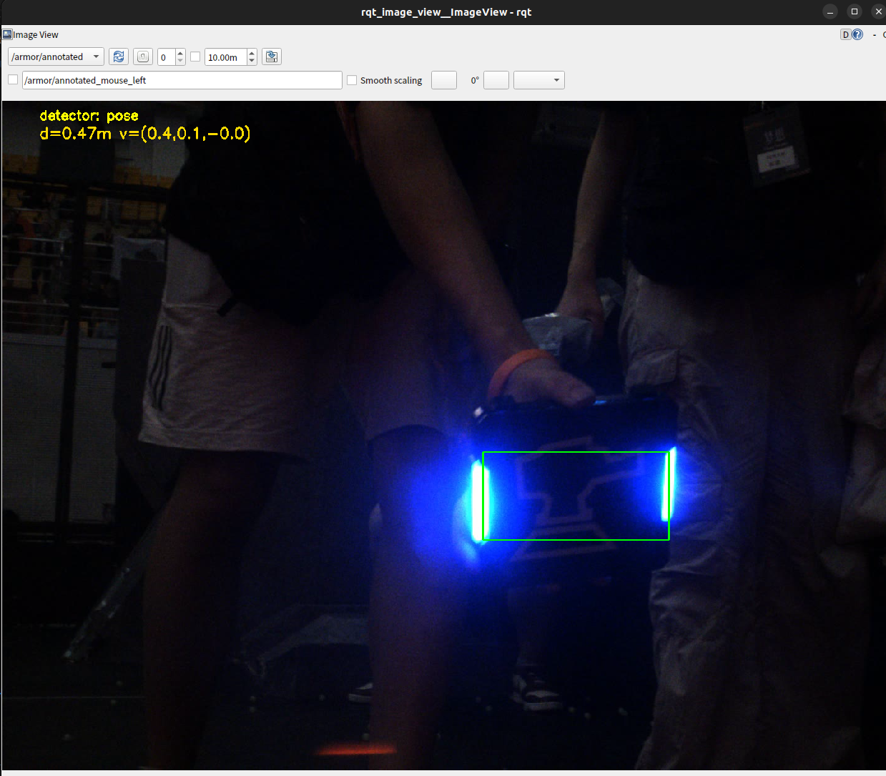
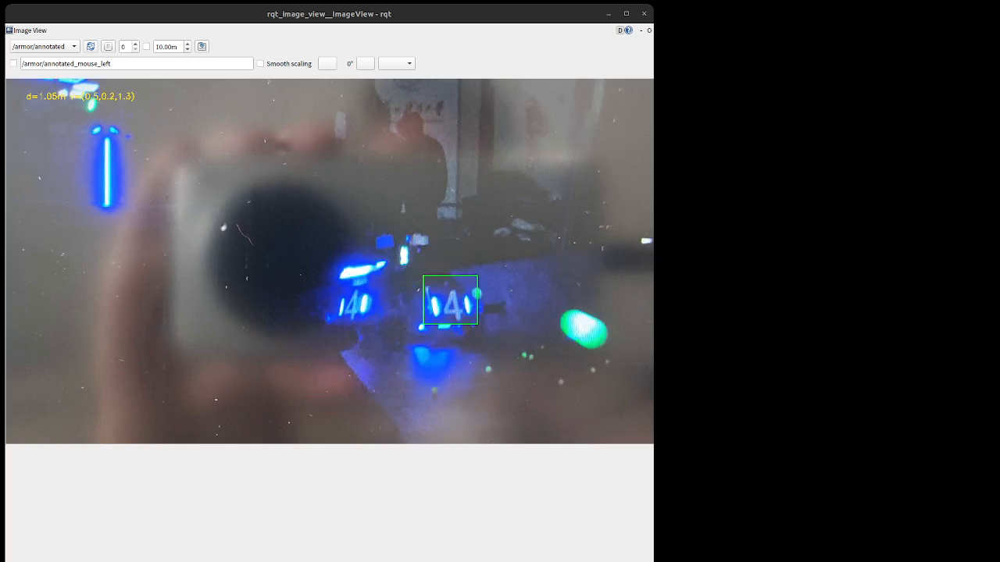

# rm27_vision — 崇实战队 27 赛季算法组补录考核（视觉方向）

视觉方向三小题的完整实现：**装甲板识别（detector）→ 装甲板跟踪（tracker）→ 接入真实相机 + 可视化**。
按题分目录组织，每部分可独立构建、运行、复现；学习过程、原理问答、踩坑与负结果的完整记录见
`docs/notes.md`（知识记录 + 工作日志，23 章）。

- 代码：C++17 + OpenCV（题1 / 题2 为普通 CMake，题3 为 ROS2 Humble ament / colcon）
- 素材：`data/demo.avi`（687 帧，自录，**只作测试集、永不进训练**）；模型全部随仓库提供
- 检测器：**默认的 bbox 模型是本仓库自己训练的（训练量小、效果一般）**；
  **推荐的四关键点模型来自深圳大学 RobotPilots 战队 26 赛季开源**（题面并未要求，是我为提高效果主动引入的）——
  两者对比见「题1」，来源链接见文末「参考仓库与教程」
- 评测：`eval_demo` 统一口径离线评测（逐帧 CSV + 汇总），本 README 里的指标数字都可复现

## 快速开始（clone → 构建 → 看题3 的效果）

题3「接入真实相机 + 可视化」是本项目的**核心效果**：图像源 → 检测 → PnP → EKF → 可视化；
题1、题2 是这条链路上的两个环节，各自的用法与验证放在自己的小节里（「题1」/「题2」），这里不重复。

```bash
# 1) 克隆（地址换成你自己的仓库）
git clone https://github.com/your-name/rm27_vision.git
cd rm27_vision

# 2) 配置环境 + 构建（自动探测 ONNX Runtime / MVS SDK，并把 bbox 与 pose 两条通路都编好）
bash scripts/setup.sh

# 3) 起完整链路：视频源 data/demo.avi + bbox 检测器 + rqt 画面 + 终端状态数字
source install/setup.bash
ros2 launch rm_armor_visualization armor_tracker.launch.py use_rqt:=true print_state:=true
```

- **前置**：Ubuntu 22.04 · ROS2 Humble · OpenCV 4.x · C++17（详见「环境与依赖」）。
- **仓库自带**测试素材 + 两个检测器模型，**不需要额外下载任何东西**；只有两个可选项要自己装：
  ONNX Runtime（四关键点检测器，`setup.sh` 会自动探测并启用）与海康 MVS SDK（真机相机 `source:=hik`）。
- **脚本与启动的分工**：`scripts/setup.sh` 只负责"环境 + 构建"，**不启动任何程序**；启动统一走 `ros2 launch`。
- 只想验证题1 / 题2（纯 C++、不需要 ROS）：命令见「题1 → 快速验证」与「题2 → 快速验证」。
- 两种检测器 × 两种素材的 4 条命令与预期效果，见下面「快速验证（题3）」。

## 考核要求对照

| 题 | 题面要求 | 本仓库交付 | 状态 | 证据 |
|---|---|---|---|---|
| 题1 detector | 识别装甲板；传统视觉或神经网络方案均可，不要求高鲁棒性 | `01_detector/`：自训 YOLOv8n bbox 检测器（默认，效果一般）+ 深大 26 开源的**四关键点检测器（推荐）**，两种实现同一接口 | ✅ | 687 帧检出 **72.49%（bbox）/ 90.25%（关键点）**；`docs/screenshots/` |
| 题2 tracker | 单板跟踪或整车估计；PnP+EKF、ESEKF、MCSKF、因子图等后端不限 | `02_tracker/`：PnP（IPPE 多解 + 破镜像 + 双重闸门）+ 常速卡尔曼；另附离线评测基础设施 | ✅ | 687 帧 A/B 表（本文件）+ `compare_eval.py` 一键复算 |
| 题3 接入与可视化 | 做到可接入**仿真、真实相机**验证算法，并有可视化界面展示（OpenGL/QT/GTK、web、foxglove、rerun 等） | `03_visualization/` + `rm_interfaces/`：图像源抽象（视频 / 网络流 / 海康工业相机）+ 完整链路 ROS2 节点 + 自定义状态话题 + rqt 2D 标注 | ✅（走通**真实相机**路线，未接仿真器） | `results/real_camera_2026-09-09.mkv`、`docs/screenshots/phone_rqt.png` |
| 导航方向 | 运动控制 / A-B / 路径规划 共 4 小题 | 未做（题面注明视觉与导航方向不强求全部完成；本仓库聚焦视觉方向） | — | — |

> 三题通过同一套「2D 点 → PnP → EKF」主链路串起来：题1 决定 2D 点从哪来，题2 决定怎么解与怎么平滑，
> 题3 决定数据从哪来、结果给谁看。这也是本工程的组织方式——**一题一目录，但共享同一份核心库**。

## 快速验证（题3：两种素材 × 两种检测器）

下面 4 条命令覆盖 **demo 视频 / 海康相机流 × bbox / pose**，都在**仓库根目录**执行。
前置：先跑一次 `bash scripts/setup.sh`，然后

```bash
source /opt/ros/humble/setup.bash && source install/setup.bash
POSE_MODEL=models/third_party/Infantry-v8n/Infantry-v8n-fp16-20260726-D1.8w-B16.onnx
```

### A. demo 视频（`data/demo.avi`，仓库自带）

> **推荐先跑 ②**：四关键点模型来自深圳大学 RobotPilots 战队 26 赛季开源，效果明显更好；
> ① 用的是本仓库自训的 bbox 模型（训练量小、效果一般），留作基线对照。

```bash
# ① 视频 + bbox 检测器（默认；本仓库自训模型，效果一般）
ros2 launch rm_armor_visualization armor_tracker.launch.py use_rqt:=true print_state:=true

# ② 视频 + 四关键点检测器
ros2 launch rm_armor_visualization armor_tracker.launch.py \
    detector:=pose pose_model_path:="$POSE_MODEL" use_rqt:=true print_state:=true
```

**预期效果**（两条一样，只有检测器不同）

- **终端**：先出现 `[armor_tracker.launch] 图像源 = video (本地文件)`、主节点的
  `检测器: bbox models/armor_yolov8n.onnx`（或 `检测器: pose（四关键点）…`）与
  `publishing /armor/annotated & /armor/state`；随后 `armor_state_printer` 每秒一行
  `d=0.52 m  pos=(0.07, -0.05, 0.51)  v=(0.00, 0.00, 0.00)`。
- **rqt 窗口**：自动弹出并循环播放 `data/demo.avi`，装甲板被绿框套住；左上角两行黄字——
  第一行 `detector: bbox` 或 `detector: pose`，第二行 `d=…m v=(…)`。
- **一眼分辨两种检测器**：`pose` 的绿框由 4 个灯条端点推出，通常会**同时套住同一块板的两根灯条**；
  `bbox` 沿用检测框，常常只套住其中一根。
- 只想要画面、不要终端数字：去掉 `print_state:=true`；不要 rqt：去掉 `use_rqt:=true`。
- 对不上时先查两件事：有没有 `source install/setup.bash`；`detector:=pose` 的构建是否启用了 ONNX Runtime（见 FAQ）。

### B. 海康相机流（`source:=hik`）

```bash
# ① 填序列号（现场只需改这一处，代码不用动）
nano data/camera.yaml            # 把 serial_number 改成相机上的实际序列号

# ② 海康 + bbox
ros2 launch rm_armor_visualization armor_tracker.launch.py source:=hik use_rqt:=true print_state:=true

# ③ 海康 + 四关键点
ros2 launch rm_armor_visualization armor_tracker.launch.py source:=hik \
    detector:=pose pose_model_path:="$POSE_MODEL" use_rqt:=true print_state:=true
```

**预期效果**

- **接上真机**：与 A 完全一样，只是画面来自相机实时流。构建需启用 MVS SDK——
  `setup.sh` 检测到 `/opt/MVS` 会自动打开 `USE_HIK_SDK`（收尾会打印开关状态）。
- **没接相机**（本仓库开发机就是这种情况，如实说明）：节点打印
  `[hik_source] 未发现相机（检查网线/USB 与相机电源）` 后退出 255，**而 `ros2 launch` 自身仍返回 0**——
  成败要看节点日志。能走到这条日志，说明 SDK 链路、构建、参数传递都是通的。
- 完整踩坑与验证边界见「04_hik」小节。

> 上面 4 条中，A 的两条已于 2026-09-11 在本仓库实测通过；B 的两条因本机没有相机，
> 只验证到"枚举不到设备并明确报错"这一步。

## 目录结构

```
rm27_vision/
├── models/                    # ONNX 模型：自训 bbox 模型 + third_party/ 下第三方四关键点权重（见「许可说明」）
├── data/                      # demo.avi 测试素材 + camera.yaml 相机配置（现场只改 serial_number）
│
├── 01_detector/               # 题1：检测器
│   ├── include/armor_detector/        #   rm_vision::ArmorDetector（bbox）
│   ├── include/armor_pose_detector/   #   rm_vision::ArmorPoseDetector（四关键点，可选 ORT 后端）
│   ├── src/                           #   两个库实现 + demo_main
│   └── scripts/convert_fp16_to_fp32.py
├── 02_tracker/                # 题2：跟踪器 + 评测基础设施
│   ├── include/armor_pnp/             #   PnP 共用解算（位姿 + 重投影误差 + yaw）
│   ├── include/armor_ekf/             #   rm_tracker::ArmorEKF（6D pos+vel）
│   ├── include/armor_corner/          #   v2 角点精修原型（负结果，默认关闭）
│   ├── include/armor_tracker/         #   v2 灯条精定位原型（负结果，已冻结）
│   ├── src/{projection,corner,pnp,tracker,lightbar}_demo.cpp
│   ├── src/eval_demo.cpp              #   离线评测主程序
│   └── scripts/compare_eval.py        #   多 tag 汇总对照表
├── 03_visualization/          # 题3：ROS2 接入与可视化
│   ├── src/armor_tracker_node.cpp     #   主节点（完整链路）
│   ├── src/armor_video_node.cpp       #   P0 教学示例（仅 detector → 标注图）
│   ├── src/image_source.hpp / .cpp    #   图像源抽象（video / ip / hik）
│   ├── src/armor_state_printer.cpp    #   可选：[工具] 把 /armor/state 打到终端（launch 的 print_state:=true）
│   └── launch/armor_tracker.launch.py #   一键启动
├── 04_hik/                    # 海康 MVS SDK 学习 demo（probe/open/grab，独立构建，不参与主构建）
├── scripts/setup.sh           # 一键配置环境 + 构建（不启动任何程序；启动统一交给 launch，见题3）
├── rm_interfaces/             # 自定义消息接口包（ArmorState.msg）
├── docs/
│   ├── notes.md               # 学习笔记（23 章：原理问答 + 踩坑 + 负结果 + 工作记录）
│   └── screenshots/           # 运行效果截图（题1 预览 + 题3 真实相机证据）
└── results/                   # 运行输出（生成物不入库；唯一入库的证据录屏 real_camera_2026-09-09.mkv）
```

## 文件清单：核心 / 工具 / 教学

判据只有一条——**"把它删掉，还能不能 `ros2 launch` 起主节点、并在 rqt 里看到检测结果？"**
每个源文件的头部也写了同样的标签（`// [核心]` / `// [工具]` / `// [教学]` / `// [负结果]`），直接打开文件也能看到。

| 类别 | 文件 | 删掉的后果 |
|---|---|---|
| **核心**（运行时必需） | `01_detector/src/armor_detector.cpp`、`armor_pose_detector.cpp`；`02_tracker/src/armor_pnp.cpp`、`armor_ekf.cpp`；`03_visualization/src/armor_tracker_node.cpp`、`image_source.hpp` / `.cpp`；`rm_interfaces/msg/ArmorState.msg`；`models/armor_yolov8n.onnx` | 主节点起不来，或少一条检测器/解算通路 |
| **工具**（非运行时，但决定"指标能不能复现"） | `02_tracker/src/eval_demo.cpp`、`02_tracker/scripts/compare_eval.py`、`01_detector/scripts/convert_fp16_to_fp32.py` | 主节点照常，但 687 帧 A/B 表无法复现 |
| **使用体验（可选，删掉不影响任何功能）** | `scripts/setup.sh`、`03_visualization/src/armor_state_printer.cpp` | 少掉"一键配置环境+构建"和"终端里的状态数字" |
| **教学 / 演示**（学习过程留档） | `01_detector/src/demo_main.cpp`；`02_tracker/src/{projection,corner,pnp,tracker,lightbar}_demo.cpp`；`03_visualization/src/armor_video_node.cpp`；`04_hik/src/*.cpp` | 无影响 |
| **负结果存档** | `02_tracker/src/armor_corner.cpp`、`light_bar_detector.cpp` | 无影响（只被 `eval_demo` 的两个可选模式引用；证据见 notes §15、§21.1） |

> 建议阅读顺序：先看「核心」的四个库 + 一个节点，再按需看「工具」（评测口径）与「教学」（推导过程）。

## 环境与依赖

**必备**

- Ubuntu 22.04 · ROS2 Humble · OpenCV 4.x · C++17（clang / GCC 均可）· CMake ≥ 3.16
- 题3 另需 `cv_bridge`（随 ROS2 desktop 安装）

**可选（按需开启，默认全关，不开也能构建并跑通默认链路）**

| 依赖 | 用途 | 开启方式 |
|---|---|---|
| ONNX Runtime ≥ 1.16（C++，解压即用） | 四关键点模型后端（`detector:=pose`） | `-DUSE_ONNXRUNTIME=ON -DONNXRUNTIME_DIR=<ORT 根目录>` |
| 海康 MVS SDK 5.0.2（默认装到 `/opt/MVS`） | 海康工业相机图像源（`source:=hik`） | `-DUSE_HIK_SDK=ON`（可加 `-DMVS_SDK_DIR=...`） |
| `rqt_image_view` | 查看标注图 | `sudo apt install ros-humble-rqt-image-view` |

**运行约定**

- 程序约定在**仓库根目录**下运行（内部用相对路径 `data/`、`models/`、`results/`）。
- 环境自检（照抄前先跑一遍，避免路径猜错）：

  ```bash
  ORT_DIR=/home/yq/my_project/ws_exam/.models_ext/onnxruntime   # ← 换成你解压 onnxruntime 的目录
  ls "$ORT_DIR/include/onnxruntime_cxx_api.h" "$ORT_DIR/lib/libonnxruntime.so"
  ```

  两个文件都在，才说明 `ORT_DIR` 填对了（构建 C 要用）。本仓库开发机上它解压在
  `/home/yq/my_project/ws_exam/.models_ext/onnxruntime`。
- **RMW**：单节点 + 命令行订阅用默认 RMW 也能跑；但**跨 RMW 传大图像**会掉帧（实测节点用 CycloneDDS、
  订阅端用 FastDDS 时，`/armor/annotated` 从 ≈26 Hz 掉到 ≈1.9 Hz）。本仓库一律用 FastDDS：
  `export RMW_IMPLEMENTATION=rmw_fastrtps_cpp`（launch 已自动设置，仅对本次启动生效）。
- 若 `~/.ros` 不可写导致 spdlog 报 `Read-only file system` / `[ros2run]: Aborted`：
  `export ROS_LOG_DIR=$PWD/.roslog`（该目录已 gitignore）。
- ⚠️ 本文档命令里的路径 / IP **请替换成你自己的**。不要粘贴带尖括号的占位符（bash 会把 `<` 当输入重定向）。

## 构建

```bash
# A. 题1 / 题2：普通 CMake，只需 OpenCV
cmake -S 01_detector -B build/01_detector -DCMAKE_BUILD_TYPE=Release && cmake --build build/01_detector -j
cmake -S 02_tracker  -B build/02_tracker  -DCMAKE_BUILD_TYPE=Release && cmake --build build/02_tracker  -j

# B. 题3：ROS2 colcon（默认配置；不引入 ORT / MVS 依赖）
source /opt/ros/humble/setup.bash
colcon build --packages-up-to rm_armor_visualization
source install/setup.bash

# C. 额外启用四关键点模型（ONNX Runtime 后端）
colcon build --packages-up-to rm_armor_visualization \
    --cmake-args -DUSE_ONNXRUNTIME=ON -DONNXRUNTIME_DIR="$ORT_DIR"

# D. 额外启用海康相机（MVS SDK）
colcon build --packages-up-to rm_armor_visualization --cmake-args -DUSE_HIK_SDK=ON

# E. 04_hik 学习 demo（独立工程）
cmake -S 04_hik -B build/04_hik && cmake --build build/04_hik -j
```

- 02_tracker / 03_visualization 通过 `add_subdirectory` 内部复用 `01_detector`，无需单独安装。
- ⚠️ **`ros2 run` 执行的是 `install/` 里的副本**：只对 `03_visualization` 源码跑 `cmake --build build/rm_armor_visualization`
  不会更新它，必须 `colcon build`（会带上 install 步骤）。否则你会觉得"代码改了但行为没变"。
- C 与 D 可同时给（同一行写两个 `-D`）；两个开关都是 CMake `option()`、默认 OFF——
  **没装 ONNX Runtime 或 MVS SDK 的人也能完整构建并跑通默认链路**。
- 改过开关要重新 `colcon build` 才生效；验证是否已启用：

  ```bash
  grep -E "USE_ONNXRUNTIME|USE_HIK_SDK" build/rm_armor_visualization/CMakeCache.txt
  ```

## 命令行通用约定（读参数前先看这一段）

| 程序 | 位置参数 | 默认值 |
|---|---|---|
| `armor_demo`、`corner_demo`、`pnp_demo`、`tracker_demo`、`lightbar_demo` | `<视频> [模型] [最大帧数]` | `data/demo.avi` / `models/armor_yolov8n.onnx` / `0`（=全部帧） |
| `projection_demo` | **不解析任何参数**（源码是 `int main()`，传参被忽略） | — |
| `eval_demo` | `<视频> <模型> <最大帧数> <tag> <corner_mode> <detector>` | 同上 / `baseline` / `bbox` / `bbox` |
| `hik_open` | `[序列号]` | `000000000000` |
| `hik_grab` | `[序列号] [取帧数]` | `000000000000` / `30` |

三条必须知道的实测行为（否则容易踩）：

1. **参数一律按位置生效**，没有 `--video=...` 这种写法；**所有程序都没有 `--help` 或 usage 文本**，
   不带参数就是"用默认值跑全片 687 帧"。
2. **帧数参数只有 `armor_demo` 会校验**：传非数字报 `[ERROR] Invalid max_frames argument: abc` 并退出 255；
   其余程序用 `atoi`，传非数字会**静默变成 0 = 跑全片**（看着像卡住，其实在跑）。
3. **`eval_demo` 的第 5/6 个参数不校验取值**：写成非法值不会报错，会静默按 `bbox` 跑，
   但汇总里仍打印你传进去的字样 → 请照 `bbox|refine` 和 `bbox|pose` 写。

参数或资源出错时多数程序抛异常退出码 **255**；`hik_grab` 的取帧数传非数字会抛未捕获异常、退出 134。

---

## 题1：装甲板识别器（detector）

两个检测器实现同一个概念接口（`detect(frame) -> 一组带 rect 的目标`），可按需切换、互不影响：

- `rm_vision::ArmorDetector`：轴对齐 bbox，角点由框四角近似（默认实现，**效果一般**，见下）
- `rm_vision::ArmorPoseDetector`：4 个灯条端点，可直接用于 PnP，无需框角近似（可选实现，**推荐**）

> **该看哪一个？**
> **方案 A（bbox）的模型是本仓库自己训练的**——训练集只有我自己录的少量素材、标注量小，
> 所以效果明显偏差（687 帧检出 72.49%、重投影 4.11 px）；
> **方案 B（四关键点）直接使用深圳大学 RobotPilots 战队 26 赛季开源的模型**，效果显著更好
> （90.25% / 1.19 px）。**想看这个项目最好的效果，请优先用方案 B**；
> 方案 A 保留的价值是"从零自训一遍"的完整过程记录，以及一个可对照的基线。

### 方案 A：自训 YOLOv8n bbox 检测器（默认，效果一般）

**这个模型是本仓库自己训练的**：训练数据为自己录制的比赛/演示视频抽帧标注（量小），
CPU 上用 OpenCV DNN 推理（**无需 onnxruntime、无需 GPU**）。
协议：`data/demo.avi` 只当测试集、**永不进训练**（域差实验与协议见 notes §16）。

| 模型 | 说明 |
|---|---|
| `models/armor_yolov8n.onnx` | 单类别 `armour`，640×640 输入，验证集 mAP50≈0.97（训练记录见 notes §3） |
| `models/armor_yolov8n_dark.onnx` | 暗化增强微调实验模型，**负结果存档，勿用**（mAP50 保持 0.974 但跨域无提升，见 notes §16） |

#### 一般用法

```bash
./build/01_detector/armor_demo [视频路径] [模型路径] [最大帧数]
```

三个参数都可省略，按位置替换即可。例如换成自己的素材、只看前 100 帧：

```bash
./build/01_detector/armor_demo /path/to/your.mp4 models/armor_yolov8n.onnx 100
```

阈值可在代码里调：`01_detector/include/armor_detector/armor_detector.hpp` 的
`setConfidenceThreshold` / `setNmsThreshold`（本工程用 0.35 / 0.45）。

#### 快速验证

```bash
./build/01_detector/armor_demo data/demo.avi models/armor_yolov8n.onnx 240
```

约 15 s，预期末尾输出：

```
[SUMMARY] processed frames : 240
[SUMMARY] frames w/ armor   : 152 (63.3%)
[SUMMARY] total detections  : 179
[SUMMARY] avg time per frame: 53.7 ms
[SUMMARY] result video saved: results/detector_demo.avi
```

#### 产物

`results/detector_demo.avi`（标注视频）+ `results/preview_*.png`（每 120 帧一张静帧）。

**预期效果**：打开 `results/detector_demo.avi`，装甲板应被绿框套住（第 240 帧本仓库实测检出 1 个目标）。
若整段视频一个框都没有 → 先查模型路径是否写对（写错或缺文件会退回默认模型/报错），再看视频路径；
若帧数与上面差很多 → 视频没读全（`frames w/ armor` 的百分比才是判据，不用和示例逐帧对齐）。

#### 效果与指标

全量 687 帧：**498 帧检出装甲板（72.49%）**；`armor_demo` 端到端（含画框与写视频）平均
**53.7–54.5 ms/帧 ≈ 18 FPS**；同口径下纯 `detect()` 耗时 **37.96 ms**（见题2 评测表）。

| demo.avi 第 240 帧（1 个目标） | demo.avi 第 600 帧（2 个目标） |
|---|---|
|  |  |

#### 已知局限（诚实声明）

- 暗光下可能把一个装甲板的两个灯条误检成两个装甲（两框 IoU≈0，NMS 不合并；根因在模型层，见 notes §15）。
- 过小 / 模糊 / 镜头切换会漏检——单帧检测的正常局限，正是题2 tracker 用跨帧信息弥补的场景。

### 方案 B：四关键点模型（可选，直出灯条端点）

模型直接回归 4 个**灯条端点**，绕过"bbox 四角近似"这一步，从根上提高 PnP 的角点质量。

- **模型来源**：**深圳大学 RobotPilots 战队 26 赛季开源**「RM2026-视觉模型统一部署库与识别模型开源」
  （社区帖链接见文末「参考仓库与教程」第 1 条）里的 `Infantry-v8n`（YOLOv8n-Pose 重设计头）。
- **许可**：权重**随仓库提交**在 `models/third_party/Infantry-v8n/`；上游标称 MIT，但其 **ONNX 元数据标注
  AGPL-3.0（Ultralytics）** → 本仓库**不对该权重做 MIT 声明**。文件名、校验和与模型元信息见该目录
  `SOURCE.md`，许可边界见下文「许可说明」。
- **输入几何**：`480×640`（4:3，与相机/素材同比例 → letterbox 退化为纯缩放，无灰边）；
  对比自训 bbox 模型的 `640×640`（4:3 素材需上下各补 80 行灰边，画布 25% 是废像素）。
- **输出布局**（实测确认，`21 × 6300`）：`row4..12` = 9 个类别分数，`row13..20` = 4 个关键点 (x,y)，
  无逐点置信度；框由 `boundingRect(4 点)` 推出。
- **关键点语义**：4 个点是**两根灯条的端点，不是板四角** → PnP 物体模型必须用 `135mm × 56mm`
  （`barEndObjectPoints`），索引映射 `kp0/kp3/kp2/kp1 → TL/TR/BR/BL`。
  用错的代价：板四角模型重投影 8.09 px、反向绕向 25.64 px，正确为 **1.09 px**（详见 notes §20.2）。
- **推理后端**：该导出图**在 OpenCV 4.x 的 cv2.dnn 上不可用**（入口 Cast 节点解析失败；转 fp32 后改为
  解码段 `NaryEltwise` 广播断言失败；python cv2 5.0 实测可跑，见 notes §20.3）→ 本工程用
  **ONNX Runtime** 构建（「构建 C」）。ORT 使用**原始导出件**，
  `scripts/convert_fp16_to_fp32.py` 的产物只适用于 cv2.dnn。
  未启用 ORT 的构建若被要求 `detector:=pose`，会在构造检测器时**明确抛异常并提示重新构建**（exit 255），不会静默失效。

运行方式见「题3 → 检测器选择」；A/B 量化对比见「题2 → 687 帧实测」。

---

## 题2：装甲板跟踪器（tracker）

### v1 主链路：PnP + 卡尔曼

```
bbox/关键点 → 2D 点(4) → PnP → 板心 3D 位置 → 卡尔曼滤波 → 状态输出
```

- **PnP**（`rm_tracker::solveArmorPose`，IPPE 多解）三层防伪解 + 一层物理兜底：
  1. `SOLVEPNP_IPPE` 出多个候选解；
  2. 优先保留 `r₃.z > 0`（板正面朝相机）的候选，破镜像解；
  3. 候选中取重投影误差最小者，且**误差 > 10 px 直接拒绝**；
  4. 物理闸门：`z > 0.2 m 且 dist < 20 m`，否则视为伪解丢弃。
  输出 `PoseResult{tvec, reproj_err_px, yaw_deg}`——后两项供评测量化角点质量。
- **滤波**（`rm_tracker::ArmorEKF`）：6D 状态（位置 + 速度），常速模型。
  当前模型线性，故 EKF 退化为 KF；漏检帧只 `predict` 不 `update`。
  骨架按 EKF 写（把常量 F/H 换成雅可比即可换测量模型），后端不受限。

### 一般用法（四个演示程序）

四个程序**参数形式完全一致**：`[视频] [模型] [最大帧数]`，都可省略（默认 `data/demo.avi` /
`models/armor_yolov8n.onnx` / 全部帧）。

| 程序 | 看什么 |
|---|---|
| `tracker_demo` | PnP → EKF 平滑对比（绿=原始、黄=EKF）+ 距离/速度叠加，终端打印原始 vs EKF 的距离跳动 |
| `pnp_demo` | PnP 闭环验证：A 段合成数据（误差应≈0）+ B 段真实数据叠加测距 |
| `corner_demo` | 框 → 四角点（v1 的 bbox 角点近似），打通 01_detector → 02_tracker |
| `projection_demo` | 3D → 2D 正投影教学（无参数） |
| `lightbar_demo` | v2 灯条精定位原型演示（负结果，见下） |

```bash
./build/02_tracker/tracker_demo [视频] [模型] [最大帧数]
./build/02_tracker/pnp_demo     [视频] [模型] [最大帧数]
./build/02_tracker/corner_demo  [视频] [模型] [最大帧数]
./build/02_tracker/projection_demo          # 无参数
./build/02_tracker/lightbar_demo [视频] [模型] [最大帧数]
```

### 快速验证

```bash
# 1) PnP 解算正确性（合成闭环，误差应≈0）
./build/02_tracker/pnp_demo data/demo.avi models/armor_yolov8n.onnx 120
# 预期效果：A 段 dist=3.015 m (true=3.015) | yaw=14.3 (true=14.3) | reproj 0.0/0.0 px
#   —— 括号里的 true 是程序自己造的合成真值，两者应完全一致；差得多说明 PnP 通路坏了

# 2) 平滑效果（生成对比视频 + 打印抖动数字）
./build/02_tracker/tracker_demo data/demo.avi models/armor_yolov8n.onnx 300
# 预期效果：打印 detected / predict-only 计数 + "跳动 raw … vs EKF …"，EKF 应明显更小；
#   生成 results/tracker_demo.avi（黄字=EKF 比绿字=原始更稳）

# 3) 同口径 A/B 评测 + 一键对照表（两条各约 20–30 s）
./build/02_tracker/eval_demo data/demo.avi models/armor_yolov8n.onnx 0 baseline bbox bbox
./build/02_tracker/eval_demo data/demo.avi models/third_party/Infantry-v8n/Infantry-v8n-fp16-20260726-D1.8w-B16.onnx 0 pose bbox pose
python3 02_tracker/scripts/compare_eval.py baseline pose
# 预期效果：compare_eval 打出 12 行并排表，其中
#   rate 72.4891 → 90.2475 (+17.7584)、pnp_ok 415 → 604、
#   reproj_px 4.1066 → 1.1915、jitter_raw 0.0853 → 0.0322
#   —— 与本文件「687 帧实测」表逐项一致；对不上先看是不是没跑满 687 帧（第 3 个参数为 0）
```

第 3 条的第 2 行需要 ONNX Runtime 构建（「构建 C」）。想先快速试可以只跑 60 帧（把 `0` 换成 `60`），
但那样数字自然会和 687 帧的表不同。

### 产物

| 程序 | 产物 |
|---|---|
| `tracker_demo` / `pnp_demo` / `corner_demo` / `lightbar_demo` | `results/<名字>.avi` + `results/<名字>_preview_*.png` |
| `projection_demo` | `results/projection_static.png`、`results/projection_motion.avi` |
| `eval_demo` | `results/eval_<tag>.csv`（逐帧）+ `results/eval_<tag>_summary.txt`（汇总） |

### 指标与证据

- `tracker_demo` 300 帧：相邻帧距离跳动 **raw 0.042 → EKF 0.020 m（抖动减半）**，
  平均距离 raw 0.654 vs EKF 0.668 m（平滑不掉真值）；
- `pnp_demo` A 段合成闭环：距离/偏航解算误差≈0、重投影≈0 px（推导见 notes §11.6）。

### 离线评测基础设施（`eval_demo`）

所有"改进是否有效"的结论都建立在这套同口径评测上——**口径不变才可比**。

```bash
# 用法（方括号=可省略，省略即用默认值，见上文「命令行通用约定」）
./build/02_tracker/eval_demo [视频] [模型] [最大帧数] [tag] [corner_mode] [detector]
python3 02_tracker/scripts/compare_eval.py tagA tagB      # 至少给两个 tag
```

（参数顺序固定；`pose` 是**第 6 个**参数，`<corner_mode>` 是第 5 个。传错会拿 pose 模型去构造 bbox 检测器。）

- 指标：检出率、PnP 通过率、重投影误差、原始/EKF 距离与抖动、检测耗时、偏航角
- **口径定义**（notes §20.4）：
  - `jitter` = **相邻且帧号连续**的有效帧之间的距离差分均值 `|d_i − d_{i−1}|`，样本数 `n` 一并输出
    （跨漏检空档不计、首帧不计——避免把"漏检造成的跳变"算成抖动）；
  - `NaN` = "本帧无有效值"（与真实的 0 区分）；`numeric_limits::max()` 作比较哨兵、`quiet_NaN()` 作缺失标记，二者不混用；
  - `refined` 列在 bbox 模式表示"角点精修成功"，在 pose 模式表示"使用了模型端点"（语义不同，别混读）；
  - 检测器阈值与物体模型配对在 `eval_demo` 与主节点中**保持一致**（pose 0.5 / bbox 0.35；pose 用灯条端点模型），
    因此评测数字描述的就是节点行为。

### 687 帧实测：bbox 基线 vs 四关键点（同一 EKF、同一口径）

`data/demo.avi` 687 帧，唯一变量是"2D 点从哪来"：

| 指标 | bbox 基线 | 四关键点 | Δ |
|---|---|---|---|
| 检出帧 | 498（72.49%） | **620（90.25%）** | +17.76 pt |
| PnP 通过 | 415（60.41%） | **604（87.92%）** | +27.51 pt |
| 重投影误差（mean / median） | 4.11 / 3.15 px | **1.19 / 0.82 px** | −2.92 px |
| 距离（raw / EKF） | 0.894 / 1.058 m | 0.964 / 0.946 m | — |
| 抖动 raw | 0.0853 m | **0.0322 m** | −62% |
| 抖动 EKF | 0.0555 m | **0.0219 m** | −60% |
| 偏航角 mean\|·\| | 18.28° | 13.27° | −5.0° |
| 检测耗时 | 37.96 ms | **26.81 ms** | −11.1 ms |

**原始数据随仓库提交**：`results/eval_baseline_summary.txt` 与 `results/eval_pose_summary.txt`
是**本仓库作者自己跑出来的原始汇总**（各约 0.5 KB，已加入 `.gitignore` 白名单），可直接核对上表数字。
有顾虑的话，用上面「快速验证」第 3 条的命令自己重跑一遍即可复现（逐帧 CSV `results/eval_<tag>.csv`
是运行后生成的，不入库）。

### v2 探索与负结果（两条路都主动放弃）

两条"用传统视觉拿到更准角点"的路线都做了、测了、否掉了，代码留在仓库里作为决策证据：

| 路线 | 做法 | 结果 | 处置 |
|---|---|---|---|
| `light_bar_detector` + `lightbar_demo`（notes §15） | 框内阈值 + 连通块 + 灯条配对拼板 | demo.avi **配对率仅 7%**：板大多大角度侧转，两灯条在画面里几乎重叠成一块 | **冻结**（设计决策与三级容错方案留档） |
| `armor_corner`（notes §21.1） | ROI → Otsu/轮廓 → PCA 主轴取端点 → 亮度梯度修正 → 四边形合理性闸门 | 中间档闸门下仅 **0.4% 的检出帧**精修成功（`bars_mean≈0.92`，大偏航常只可见**单根**灯条）；严格档 0% | **默认关闭**，不接入主节点 |

- `armor_corner` 的实测调试图（ROI / 二值图 / 叠加）在设了环境变量 `RM_CORNER_DEBUG`（**任意值**，含 `0`）
  后输出到 `results/corner_dbg_*.png`；不设则完全不落盘。
- **它不影响交付效果**：主节点根本不链接 `armor_corner`（grep 零引用），唯一入口是 `eval_demo` 的
  `corner_mode=refine` 且**默认值为 `bbox`**。保留它是为了留下"为什么转向神经网络"的可复现证据。
- 复现负结果：

  ```bash
  RM_CORNER_DEBUG=1 ./build/02_tracker/eval_demo data/demo.avi models/armor_yolov8n.onnx 200 t_refine refine bbox
  ```

### 已知局限（v1 简化）

- **单目标**：每帧挑**面积最大**的板（≈最近）。两块板交替最大时会跳目标——多目标跟踪需要数据关联 +
  每目标一个滤波器，未做（理由见 notes §14.3）。
- 无装甲数字识别、无整车位姿估计、无目标预测；内参未标定（见题3 局限）。

---

## 题3：ROS2 接入与可视化

### 架构

```
        图像源               检测器             解算           滤波
  (video / ip / hik)  →  (bbox | pose)  →  PnP  →  EKF  ─┬─→  /armor/state       (自定义状态)
                                                          └─→  /armor/annotated (标注图, 供可视化)
```

| 文件 | 职责 |
|---|---|
| `03_visualization/src/armor_tracker_node.cpp` | 主节点：完整链路，发布 `/armor/state` + `/armor/annotated` |
| `03_visualization/src/image_source.hpp` / `.cpp` | 图像源抽象（`ImageSource` 接口 + 工厂）；海康代码在文件内 `#ifdef RM_USE_HIK_SDK` 段 |
| `03_visualization/src/armor_video_node.cpp` | P0 教学示例：仅 detector → 标注图，保留作对比学习 |
| `rm_interfaces/msg/ArmorState.msg` | `std_msgs/Header header; Point position; Vector3 velocity; float64 distance` |
| `03_visualization/launch/armor_tracker.launch.py` | 一键启动（含环境变量自动化） |

### 一般用法：launch 参数表

```bash
ros2 launch rm_armor_visualization armor_tracker.launch.py [参数:=值 ...]
```

| 参数 | 默认值 | 说明 |
|---|---|---|
| `source` | `video` | 入口参数：`video` / `ip` / `hik`，launch 把它翻译成节点的 `video_path` / `camera_config` |
| `video_path` | `data/demo.avi` | `source:=video` 时的视频路径 |
| `ip_url` | 空 | `source:=ip` 时的流地址（**缺参会直接报错**） |
| `camera_config` | `data/camera.yaml` | `source:=hik` 时的 yaml 配置 |
| `model_path` | `models/armor_yolov8n.onnx` | bbox 检测器模型 |
| `detector` | `bbox` | `bbox` / `pose` |
| `pose_model_path` | 空 | `detector:=pose` 时**必填**（缺了节点报错退出） |
| `repo_root` | `.` | 相对路径基准；不在仓库根目录启动时给绝对路径 |
| `use_rqt` | `false` | 是否附带启动 `rqt_image_view` |
| `print_state` | `false` | 是否附带启动 `armor_state_printer`：把 `/armor/state` 按 1 Hz 打到终端（**省掉第二个终端**） |
| `rmw` | `rmw_fastrtps_cpp` | 本次启动的 RMW 实现 |
| `mvs_lib_dir` | `/opt/MVS/lib/64` | `source:=hik` 时的 MVS 库目录 |

节点自身的参数（`ros2 run` 时用）：`camera_config`、`video_path`、`model_path`、`detector`、`pose_model_path`。

### 配置环境与构建（`scripts/setup.sh`）

`scripts/setup.sh` **只做两件事：配置环境 + 构建**，不启动任何程序——启动入口统一是 `ros2 launch`（见下一小节）。

```bash
bash scripts/setup.sh                              # 环境 + 构建（自动探测 ONNX Runtime / MVS SDK）
bash scripts/setup.sh --clean                      # 先清掉 build/ install/ log/ 再全量重建
ORT_DIR=/your/onnxruntime bash scripts/setup.sh    # 手工指定 ORT 位置
```

它依次做三件事：

1. `source` ROS2 环境，并设好本工程需要的 `RMW_IMPLEMENTATION` 与 `ROS_LOG_DIR`；
2. 构建题1、题2（普通 CMake）、题3（`colcon build`）、以及 04_hik 学习 demo；**探测到 ONNX Runtime
   就把 `detector:=pose` 通路一起编进去**，探测到 MVS SDK 就编上 `source:=hik`；
3. 打印开关状态（`USE_ONNXRUNTIME` / `USE_HIK_SDK`）与**下一步该跑的命令**（bbox 与 pose 各一条，都是 `data/demo.avi`）。

想自己一步步敲也完全可以——等价的手工命令就是「构建」一节那几条，结果一样。

### 快速验证

> **4 条启动命令（demo 视频 / 海康相机流 × bbox / pose）与各自的预期效果已在文件顶部
> 「快速验证（题3：两种素材 × 两种检测器）」**，这里只补充**不开 rqt 的单终端自检**方式。

```bash
REPO=$HOME/my_project/ws_exam/rm27_vision     # ← 换成你 clone 下来的绝对路径
cd "$REPO"
source /opt/ros/humble/setup.bash && source install/setup.bash

# 后台起节点 → 取一条状态 → 自动结束（无需 GUI）
timeout 25 ros2 run rm_armor_visualization armor_tracker_node --ros-args -p video_path:=data/demo.avi &
sleep 4
timeout 25 ros2 topic echo /armor/state --once
```

输出形如：

```yaml
header: {stamp: {…}, frame_id: camera}
position:  {x: -0.637, y: -0.435, z: 1.305}
velocity:  {x: -1.729, y: -0.848, z: 1.672}
distance:  1.5159
```

**预期效果**：`ros2 topic echo --once` 打印**一条** YAML —— `frame_id` 必须是 `camera`，
`position` / `velocity` / `distance` 三个字段都有数值，`distance` 在 0.3~2 m 量级
（示例是 1.5 m；`data/demo.avi` 是近距离素材，数值随帧变化）。

**常见异常**：一直空白等不到消息 → 多半是 RMW 不一致或 `~/.ros` 不可写（见 FAQ）；
`distance` 是 0 或 NaN → 该帧 PnP 没出解，等几帧即可（漏检是正常的）；
节点一起来就退出 → 看它打印的第一条 ERROR（路径/模型/相机问题都会在那里明说）。

### 手动分终端（完整链路）

```bash
# 终端 1：主节点（视频源循环播放）
source /opt/ros/humble/setup.bash && source install/setup.bash
ros2 run rm_armor_visualization armor_tracker_node --ros-args -p video_path:=data/demo.avi

# 终端 2：看图 / 看状态
ros2 run rqt_image_view rqt_image_view /armor/annotated
ros2 topic echo /armor/state
```

### 检测器选择（`detector:=bbox|pose`）

默认仍用自训 bbox 模型；切到四关键点模型（模型说明见「题1 方案 B」）：

```bash
source /opt/ros/humble/setup.bash && source install/setup.bash
POSE_MODEL=models/third_party/Infantry-v8n/Infantry-v8n-fp16-20260726-D1.8w-B16.onnx   # 随仓库提交，相对路径即可

# launch 方式
ros2 launch rm_armor_visualization armor_tracker.launch.py detector:=pose pose_model_path:="$POSE_MODEL"

# 或 ros2 run 方式
ros2 run rm_armor_visualization armor_tracker_node --ros-args \
    -p video_path:=data/demo.avi -p detector:=pose -p pose_model_path:="$POSE_MODEL"
```

前置条件：这个二进制必须是**启用 ORT** 构建的（「构建 C」）；否则节点会明确报
`ArmorPoseDetector 需要 ONNX Runtime 后端：请用 -DUSE_ONNXRUNTIME=ON -DONNXRUNTIME_DIR=… 重新构建` 并退出。

切换只影响"2D 点从哪来"：节点内部两条路都归到同一组变量（`target_rect` / `target_corners` / `has_target`），
之后的 PnP → EKF → 发布**完全共用**。节点还会把当前模式**标在画面上**（左上角第一行
`detector: bbox` / `detector: pose`），所以截图和录屏本身就能说明走的是哪条通路。

**预期效果**：终端打印 `检测器: pose（四关键点）models/third_party/…onnx`；
在 rqt 里看，左上角第一行是 `detector: pose`，且绿框通常会**同时套住一块板的两根灯条**
（bbox 模式常常只套住其中一根）。

pose 模式下的 rqt 实时标注（绿框由 4 个灯条端点推出，左上角两行分别是模式与距离/速度）：



### 真实相机

```bash
# A. 手机 IP Webcam（Android 的 "IP Webcam" 类 App）：必须横屏，地址必须带 /video
ros2 launch rm_armor_visualization armor_tracker.launch.py \
    source:=ip ip_url:=http://192.168.1.10:8080/video        # 换成你手机上显示的实际地址

# B. 海康工业相机（需以 USE_HIK_SDK=ON 构建；现场只改 yaml 里的序列号）
$EDITOR data/camera.yaml      # 把 serial_number 改成相机上的实际序列号
ros2 launch rm_armor_visualization armor_tracker.launch.py source:=hik use_rqt:=true
```

> 手机流地址**必须带 `/video`**（裸地址是网页，`VideoCapture` 打不开）；竖屏会产生 90° 旋转元数据 →
> PnP 镜像假解（z<0），**务必横屏**。

### 真实相机验证证据（2026-09-09）



- 截图 `docs/screenshots/phone_rqt.png`：检测框锁定目标，`d=1.05m v=(0.5,0.2,1.3)` 实时输出；
- 录屏 `results/real_camera_2026-09-09.mkv`（24 s）：手机实拍 → detect → PnP → EKF → 可视化全程；
- 内容决策：靶面用 `data/demo.avi`（**非训练集、光照差、角度极端**）回放——苛刻条件下仍持续锁定，
  比理想素材更能证明真实鲁棒性；`d≈0.8~1.1 m` 与手机到屏幕的实际距离同量级（内参为近似，见局限）。

### 可视化

- **rqt 2D 标注**（当前交付形态）：`/armor/annotated` 上叠加检测框、距离与速度文字；
  `/armor/state` 可以用 `ros2 topic echo` 直接看。
- **Foxglove**：标准 `sensor_msgs/Image` 可直接订阅；自定义消息需要加载 `rm_interfaces` 的定义。
  P0 阶段曾用它做过 `/armor/state → 3D 位姿` 的展示节点，因不属于题面必需、且要动稳定文件而**回档移除**
  （notes §17.4），需要时可作为扩展重新接上。
- 未接仿真器：题面要求"可接入仿真、真实相机验证算法"，本工程走通**真实相机**路线；
  河科视觉仿真器（内参精确已知）是后续可选项。

### 已知局限

- **内参为演示级近似**：按分辨率 + 假定水平 FOV≈72° 推导（`computeK`），未做棋盘格标定 →
  距离量级可信、绝对精度需标定（接入新相机前需要标定的必要性见 notes §8.11；**标定本身尚未做**）。
- **可视化带宽**：1440×1080×3 ≈ 4.67 MB/帧，30 Hz ≈ 140 MB/s，本机 rqt 订阅端吃力（表现为"卡"）；
  曾实现"限流 + 缩放"两参数，按要求回档——真机相机流阶段再处理（notes §20.7）。
- 单目标、无数字识别、无整车位姿（同题2 局限）。

---

## 04_hik：海康 MVS SDK 学习 demo

独立工程（不参与主构建），三步递进，把 SDK 的使用拆开学会：

| 程序 | 参数（`[ ]` 可省） | 默认 | 内容 |
|---|---|---|---|
| `hik_probe` | 无 | — | 枚举设备，打印型号 / 序列号（第一个 `MV_CC_*` 调用） |
| `hik_open` | `[序列号]` | `000000000000` | 按序列号打开相机，关闭自动曝光并设曝光 / 增益 |
| `hik_grab` | `[序列号] [取帧数]` | `000000000000` / `30` | 取若干帧，把 SDK 缓冲转成 OpenCV BGR（`cv::Mat`） |

```bash
# 构建
cmake -S 04_hik -B build/04_hik && cmake --build build/04_hik -j

# 快速验证（本机没接相机时：会正常提示"未发现相机"并退出 0，属预期）
./build/04_hik/hik_probe
./build/04_hik/hik_open 你的相机序列号
./build/04_hik/hik_grab 你的相机序列号 30
```

**预期效果**

- **没接相机**时（本仓库开发机就是这种情况）：三个程序都会打印类似
  `发现 0 台相机：` / `未发现相机（本机无相机属预期）`，然后**退出码 0** ——
  能跑到这一行就说明 SDK 环境、编译、链接全都 OK，差的只是硬件。
- **接上相机**时：`hik_probe` 会列出型号与序列号（调试阶段要拿的就是这个序列号）；
  `hik_grab` 会在 `results/` 下写出首帧图片（`hik_grab_0000.png`）。
- **常见异常**：报找不到 `libMvCameraControl.so` → 见下面那条；`hik_grab` 的取帧数传了非数字 → 进程 abort（退出 134）。

- 本机实测**不需要**手工设 `LD_LIBRARY_PATH`（CMake 已把 `/opt/MVS/lib/64` 写进可执行文件的 RUNPATH，
  可 `readelf -d build/04_hik/hik_grab | grep -i path` 查看）。若你的环境仍报找不到 `libMvCameraControl.so`，
  再 `export LD_LIBRARY_PATH=/opt/MVS/lib/64:$LD_LIBRARY_PATH`。
- 取帧数传非数字会抛未捕获异常、进程 abort（退出 134）——传数字即可。
- 主节点用的是封装后的版本（`image_source.cpp` 的 `#ifdef RM_USE_HIK_SDK` 段 + `data/camera.yaml`）：
  **现场展示只需改 `data/camera.yaml` 里的 `serial_number`，代码不用动**。踩坑记录见 notes §19。

> **验证边界（如实说明）**：本工程开发机上**没有海康相机**，所以这条通路验证到
> 「枚举到 0 台设备并优雅提示、退出码 0」为止；`StartGrabbing` → `GetImageBuffer` → `cv::Mat`
> 这段取流与像素格式转换（含 MVS 5.0.2 的 `pBufAddr` 踩坑修正）已按 SDK 头文件实现，
> **需在接上真机后确认**。它本来就是按"现场会接海康相机"准备的：届时填上序列号即可切流。

---

## 证据与复现索引

`results/` 是运行输出目录（已在 `.gitignore` 里）。其中**入库的只有三样**：

1. `real_camera_2026-09-09.mkv` —— 真实相机验证的录屏（提交证据）；
2. `eval_baseline_summary.txt`、`eval_pose_summary.txt` —— **本仓库作者自己跑出来的原始评测汇总**
   （各约 0.5 KB），用于直接核对「687 帧实测」表；有顾虑可照题2 快速验证第 3 条自己重跑一遍复现。

其余全部是**运行后生成**的，按上表命令即可重新得到。

| 想验证什么 | 入库的证据 | 复现命令 |
|---|---|---|
| 题1 检出效果 | `docs/screenshots/detector_preview_*.png` | `./build/01_detector/armor_demo data/demo.avi models/armor_yolov8n.onnx 240` |
| 检测器 A/B 全指标 | 本文件「687 帧实测」表 | 两条 `eval_demo` + `compare_eval.py`（见题2 快速验证第 3 条） |
| 题2 PnP 解算正确性 | notes §11.6（数字可复算） | `./build/02_tracker/pnp_demo data/demo.avi models/armor_yolov8n.onnx 120` |
| 题2 平滑效果 | —（生成物） | `./build/02_tracker/tracker_demo data/demo.avi models/armor_yolov8n.onnx 300` → `results/tracker_demo.avi` |
| ② 角点精修负结果 | —（调试图生成物） | `RM_CORNER_DEBUG=1 ./build/02_tracker/eval_demo data/demo.avi models/armor_yolov8n.onnx 200 t_refine refine bbox` → `results/corner_dbg_*.png` |
| 题3 真实相机验证 | `results/real_camera_2026-09-09.mkv`、`docs/screenshots/phone_rqt.png` | `source:=ip` + 手机横屏 |
| pose 模式的可视化 | `docs/screenshots/pose_rqt.png` | `ros2 launch rm_armor_visualization armor_tracker.launch.py detector:=pose pose_model_path:="$POSE_MODEL" use_rqt:=true` |
| 原理与踩坑全过程 | `docs/notes.md`（23 章） | 按目录读；§20（四关键点与评测）、§21（负结果全录 + 交付对照）、§22（与 README 的双向对照）是本轮核心 |

## FAQ

| 现象 | 原因 / 解法 |
|---|---|
| `detector:=pose` 报"需要 ONNX Runtime 后端" | 该构建未开 ORT → 按「构建 C」重建（`-DUSE_ONNXRUNTIME=ON -DONNXRUNTIME_DIR="$ORT_DIR"`） |
| ORT 报 float16/float32 类型不匹配 | 用了 `convert_fp16_to_fp32.py` 的产物 → ORT 必须用**原始导出件** |
| `source:=hik` 节点死掉，但 `ros2 launch` 看起来是成功的 | 无相机 / 序列号没填时节点 exit 255，**launch 进程本身仍返回 0** → 以节点日志为准 |
| 某条命令像卡住了，不结束 | 帧数参数传了非数字 → `atoi` 静默变 0 = 跑全片（只有 `armor_demo` 会报错） |
| 改了 `03_visualization` 的源码，`ros2 run` 行为却没变 | `cmake --build` 不更新 `install/`；请用 `colcon build --packages-up-to rm_armor_visualization` |
| 订阅 `/armor/annotated` 收不到消息 | 该话题用的是 **SensorDataQoS（BEST_EFFORT）**：自写订阅者要用 `qos_profile_sensor_data`（Python）或 `rclcpp::SensorDataQoS()`；`ros2 topic echo` 需加 `--qos-reliability best_effort` |
| `ros2 run` 报 `[ros2run]: Aborted` / spdlog `Read-only file system` | `~/.ros` 不可写 → `export ROS_LOG_DIR=$PWD/.roslog` |
| rqt 无画面 / topic 大量 message lost | 跨 RMW 传大图像不稳 → `export RMW_IMPLEMENTATION=rmw_fastrtps_cpp`（与发布端一致） |
| rqt 打开后是渐变占位图 | 手动下拉常没真正订阅 → 直接带话题：`rqt_image_view rqt_image_view /armor/annotated` |
| 手机流 "Stream ends prematurely" | URL 少了 `/video` 后缀 |
| 检测框在但 z<0 / 距离乱跳 | 手机竖屏（旋转元数据）→ 横屏解决 |
| 距离绝对值和真实差一截 | 内参未标定（HFOV≈72° 近似）→ 只论量级；为什么要标定见 notes §8.11（标定本身尚未做） |
| 从别的目录启动后节点立刻退出 | 相对路径失效 → 加 `repo_root:=/绝对/路径/rm27_vision` |

## 参考仓库与教程

本工程站在这些开源项目与教程的肩膀上（考核题面所推荐的资料也在其中）。**按"我们用它做了什么"排序**：

| # | 开源项目 / 教程 | 链接 | 我们用到了什么 |
|---|---|---|---|
| 1 | **深圳大学 RobotPilots｜RM2026 视觉模型统一部署库与识别模型开源** | https://bbs.robomaster.com/article/1942761 | **直接使用了其中的四关键点模型 `Infantry-v8n`**（题1 方案 B / `detector:=pose`）：权重随仓库提交在 `models/third_party/Infantry-v8n/`，来源与 sha256 见该目录 `SOURCE.md`，关键点语义按 notes 实测确认 |
| 2 | 同济大学 SuperPower｜`sp_vision_25` 视觉框架 | https://github.com/TongjiSuperPower/sp_vision_25 | 灯条端点 3D 建模思路、装甲板尺寸 135×125 / 230×127、灯条长度 56mm 的出处 → 本工程 `barEndObjectPoints`（源码曾在工作区本地 `reference/` 对照阅读，**未随本仓库发布**） |
| 3 | 河北科技大学 Actor&Thinker｜RM2026 视觉算法仿真器 | https://bbs.robomaster.com/article/1887395 | "仿真里内参精确已知"的思路（本工程未接入，列为后续可选项） |
| 4 | 河北科技大学 Actor&Thinker｜RM2026 YOLO26 端到端装甲板 ONNX 模型 | https://bbs.robomaster.com/article/1886180 | 端到端 / keypoint 类识别模型的对照阅读 |
| 5 | 武汉科技大学崇实战队｜RM2026 算法综合开源（视觉 / 导航 / 决策） | https://bbs.robomaster.com/article/1936030 | 自瞄链路与工程结构的整体对照 |
| 6 | 深圳大学 RobotPilots｜RM2024 识别模型 | https://bbs.robomaster.com/article/54091 | 早期装甲板识别模型的对照 |
| 7 | 上科大十等星｜26 赛季自瞄教程 | https://fcn47qghdcqf.feishu.cn/wiki/Hcw1wxTMZicx0xkinuQcKHetn5d | 概念与工程结构的入门对照（题面推荐资料） |
| 8 | Ultralytics YOLOv8 | https://github.com/ultralytics/ultralytics | 自训 bbox 模型的训练链；其 **AGPL-3.0** 同样适用于本仓库里的权重（见「许可说明」） |
| 9 | ONNX Runtime | https://github.com/microsoft/onnxruntime | 四关键点模型的推理后端（可选构建项） |
| 10 | OpenCV · ROS2 Humble | https://opencv.org · https://docs.ros.org/en/humble | 基础依赖 |

> 社区帖链接需要登录 RoboMaster 社区才能查看；若失效可按标题在社区内搜索。
> 我们对这些项目的学习、对照与踩坑过程记录在 `docs/notes.md`。

## 许可说明

本仓库的许可**按内容分层**，不是单一许可：

| 内容 | 许可 | 说明 |
|---|---|---|
| 代码（`01_detector` / `02_tracker` / `03_visualization` / `04_hik` / `rm_interfaces`） | **MIT**（见根目录 `LICENSE`） | 与两个 `package.xml` 的声明一致 |
| `models/armor_yolov8n.onnx`、`models/armor_yolov8n_dark.onnx`（自训） | 按其 ONNX 元数据：**AGPL-3.0** | 由 Ultralytics YOLOv8 训练链产出，元数据自带 `license = AGPL-3.0 (https://ultralytics.com/license)` |
| `models/third_party/Infantry-v8n/`（第三方） | 按其自身许可：**AGPL-3.0** | 深大 RobotPilots 开源权重，**非本仓库原创**；来源、校验和见该目录 `SOURCE.md` |

即：**代码用 MIT，模型权重沿用各自上游许可**，本仓库不对权重做 MIT 声明。
若需闭源商业使用这些权重，请自行确认或获取上游（Ultralytics）的企业许可。

## 修订记录

> **版本号约定**：只有在**功能或效果有实质变化**时才进位大版本（v1 → v2 → v3）；
> 纯文档结构、表述与使用体验的优化只递进次版本（v3.1、v3.2 …），不改动任何算法与接口。

| 版本 | 日期 | 说明 |
|---|---|---|
| v1.0 | 2026-09-08 | 三题初稿运行说明 + 证据截图 |
| v2.0 | 2026-09-09 | 复盘后重构：三题并列结构、状态总览表、补题2 运行/指标、FAQ、参考资料对照；修复录屏死链 |
| v3.0 | 2026-09-11 | 按考核题面重写全文（功能层面：① 评测基础设施 + ② 角点精修负结果 + ③ 四关键点检测器）：补「考核要求对照」；新增题2 评测口径与 687 帧 A/B 表、两条 v2 负结果；题1 补四关键点检测器；题3 补检测器选择与真实相机；新增 04_hik 说明、证据索引、许可说明 |
| v3.1 | 2026-09-11 | 文档：四关键点权重入库（`models/third_party/` + `SOURCE.md`）；「许可说明」改为按内容分层 |
| **v3.2** | 2026-09-11 | 文档：全量命令实测校验后重写操作部分——新增「30 秒快速验证」「命令行通用约定」「文件清单：核心/工具/教学」；每题补齐「一般用法 → 快速验证 → 产物」；在源文件头加角色标签。修正 5 处与实测不符的说法（hik 的 `LD_LIBRARY_PATH` 非必需、`RM_CORNER_DEBUG` 传任意值即生效、`RMW` 只在跨 RMW 传大图时才是瓶颈、题面"仿真、真实相机"是并列而非二选一、② 的调试图是 `corner_dbg_*`）；补 `source:=hik` 时 `ros2 launch` 返回 0 但节点已死的提醒、海康通路的验证边界、pose 模式运行截图 |
| **v3.3** | 2026-09-11 | 体验优化：新增「快速开始（clone → 跑起来）」；新增 `scripts/demo.sh` 一键启动脚本（手工版照旧保留）；新增可选节点 `armor_state_printer` + launch 参数 `print_state`（单终端即可看到状态数字）；主节点在画面上叠加当前检测器模式（`detector: bbox/pose`，便于截图自证）；把两份评测汇总加入 `.gitignore` 白名单随仓库提交；每处验证步骤补「预期效果」（含常见异常判据）；`docs/notes.md` 同步重编目录（两级索引 + 状态标签）并新增 §22「与 README 的双向对照」 |
| **v3.4** | 2026-09-11 | 职责收窄：`scripts/demo.sh`（会启动程序）改为 **`scripts/setup.sh`（只配置环境 + 构建，不启动任何程序）**，启动入口统一收敛到 `ros2 launch`；`setup.sh` 会自动探测 ONNX Runtime / MVS SDK 并把 bbox 与 pose 两条通路都编好，收尾打印两条素材 demo.avi 的启动命令；更换带 `detector: pose` 标签的 rqt 截图 |
| **v3.5** | 2026-09-11 | 突出核心：顶部「快速开始」只引导到题3（clone → `scripts/setup.sh` → `ros2 launch`）；原「30 秒快速验证」改为 **「快速验证（题3：两种素材 × 两种检测器）」**，只保留题3 的 4 条命令（demo 视频 / 海康相机流 × bbox / pose）与各自预期效果，题1、题2 的验证命令回归各自小节 |
| **v3.6** | 2026-09-11 | 如实标注模型强弱：说明 **bbox 模型是本仓库自训（训练量小、效果一般）**，**推荐使用深大 26 开源的 pose 模型**并标注其来源；新增文末 **「参考仓库与教程」**（10 条带链接，首位即深大 RobotPilots 的模型开源帖） |
