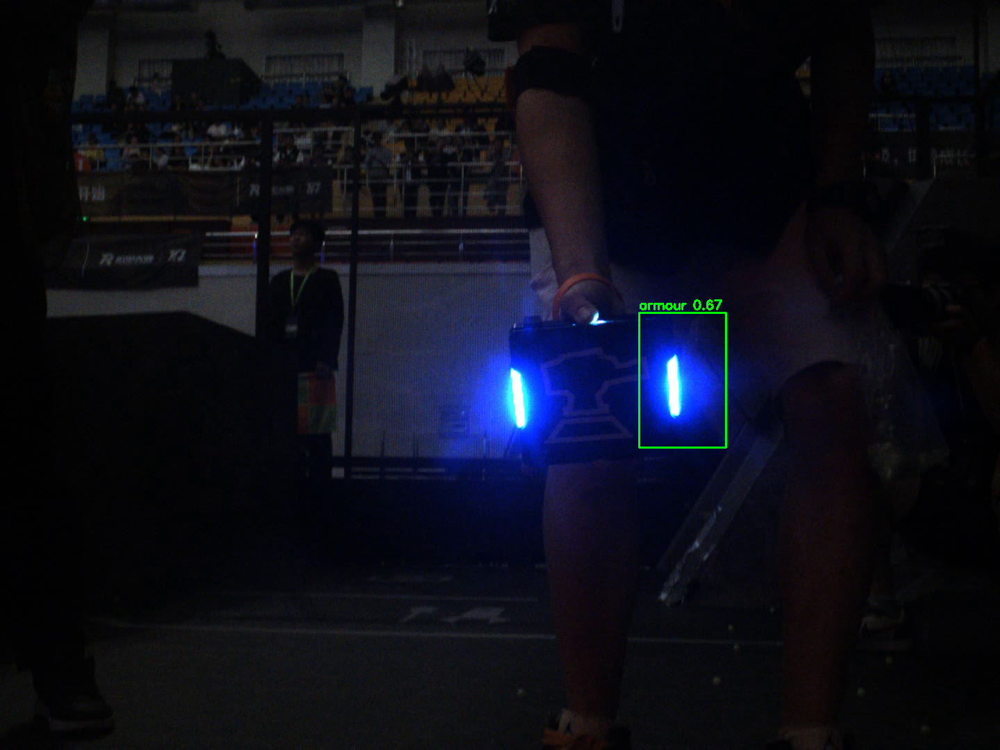
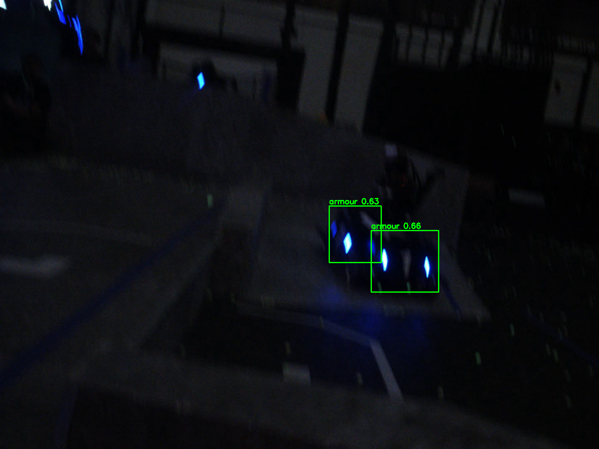

# rm27_vision — 崇实战队 27 赛季算法补录（视觉方向）

视觉方向三小题：装甲板识别（detector）→ 装甲板跟踪（tracker）→ 仿真/相机接入与可视化。
本仓库按题目分目录组织，每部分可独立构建运行。

```
rm27_vision/
├── models/             # 已导出的 ONNX 模型（训练工程见工作区 trainning/）
├── data/               # 测试素材（demo.avi：自瞄演示视频，1440x1080@30fps）
├── 01_detector/        # 题1：YOLOv8n 装甲板识别器（静态库 + 演示程序）
├── 02_tracker/         # 题2：装甲板跟踪器（进行中）
├── 03_visualization/   # 题3：ROS2 接入与可视化（进行中）
├── docs/
│   ├── notes.md        # 学习笔记（原理问答，供面试复习）
│   └── screenshots/    # 运行效果截图
└── results/            # 运行输出（已被 gitignore）
```

## 构建

```bash
# 在仓库根目录
cmake -S 01_detector -B build/01_detector -DCMAKE_BUILD_TYPE=Release
cmake --build build/01_detector -j
```

## 题1：装甲板识别器（detector）

方案：YOLOv8n 神经网络（自训，CPU 可用 OpenCV DNN 推理，无需 onnxruntime）。

- 模型：`models/armor_yolov8n.onnx`
  （训练自工作区 `trainning/`，exp1-3，单类别 `armour`，mAP50≈0.97；训练数据为自录视频抽帧标注）
- 库：`01_detector`（`rm_vision::ArmorDetector`，接口 `detect(frame) -> vector<Armor>`）
- 演示程序：`armor_demo`（读视频 → 逐帧检测 → 画框 → 存结果视频）

### 运行

```bash
./build/01_detector/armor_demo data/demo.avi                        # 全部帧（默认阈值 0.35/0.45）
./build/01_detector/armor_demo data/demo.avi models/armor_yolov8n.onnx 240   # 只跑前 240 帧
```

参数依次为：`<视频路径> [模型路径] [最大帧数]`，均可省略使用默认值
（`data/demo.avi`、`models/armor_yolov8n.onnx`、全部帧）。

输出：`results/detector_demo.avi`（标注视频）、`results/preview_*.png`（每 120 帧一张预览）。

> 注意：程序约定在**仓库根目录**下运行（默认相对路径 `data/`、`models/`）。

### 效果展示

全量 687 帧实测：**498 帧检出装甲板（72.5%）**，CPU 平均 **54.5 ms/帧（≈18 FPS）**。

| demo.avi 第 240 帧（检出 1 个） | demo.avi 第 600 帧（检出 2 个） |
|---|---|
|  |  |

部分帧因装甲板过小/模糊/镜头切换而漏检，属单帧检测的正常局限，题2 tracker 将结合时序信息弥补。

### 已知瑕疵与后续

- 暗光下模型可能把一个装甲板的两个灯条误检成两个装甲（两灯条框 IoU≈0，NMS 不会合并；根因在模型层）。
- 单帧漏检 → 交给题2 tracker 用跨帧信息处理。
